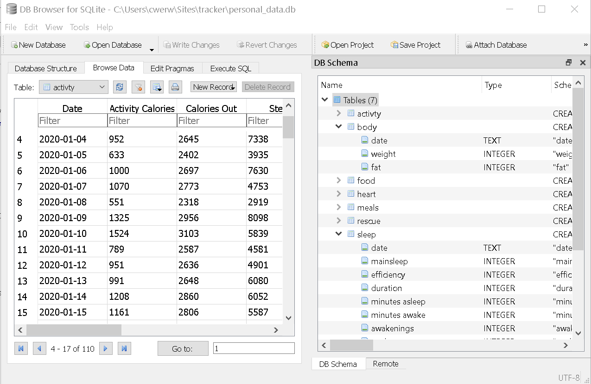
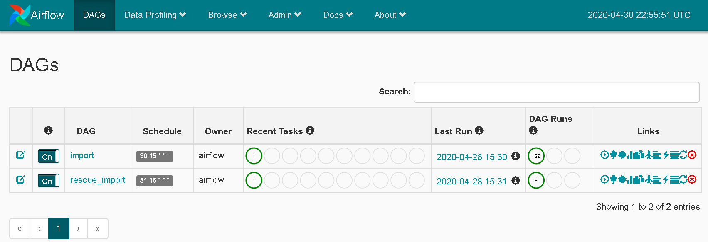
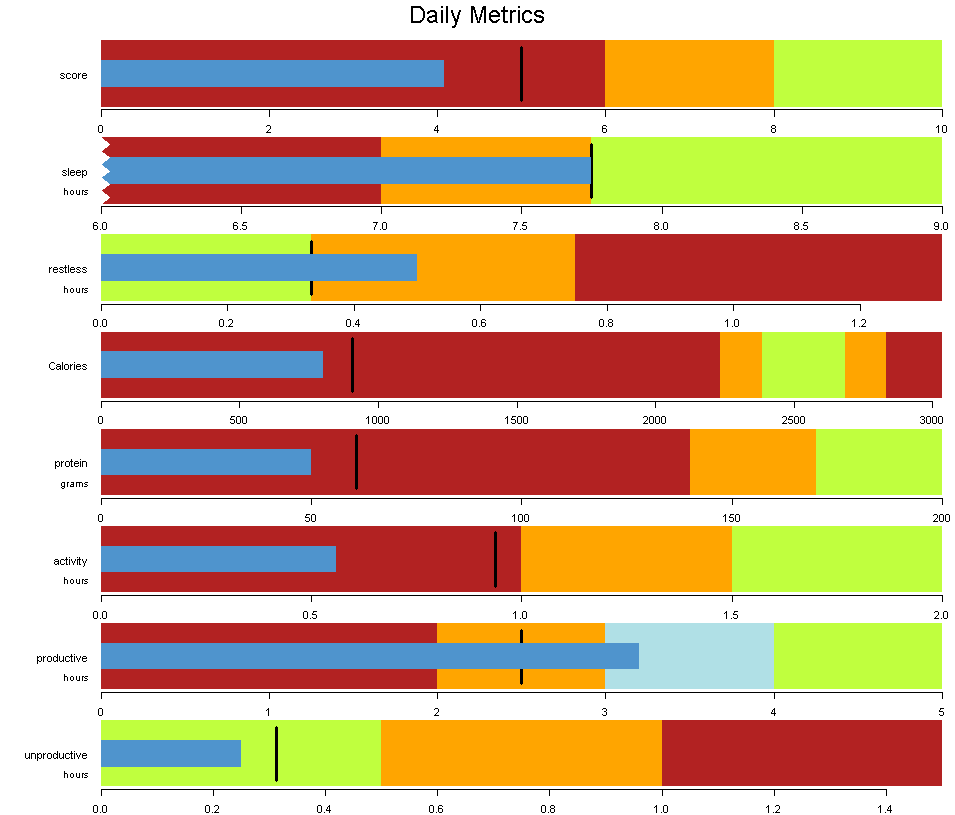
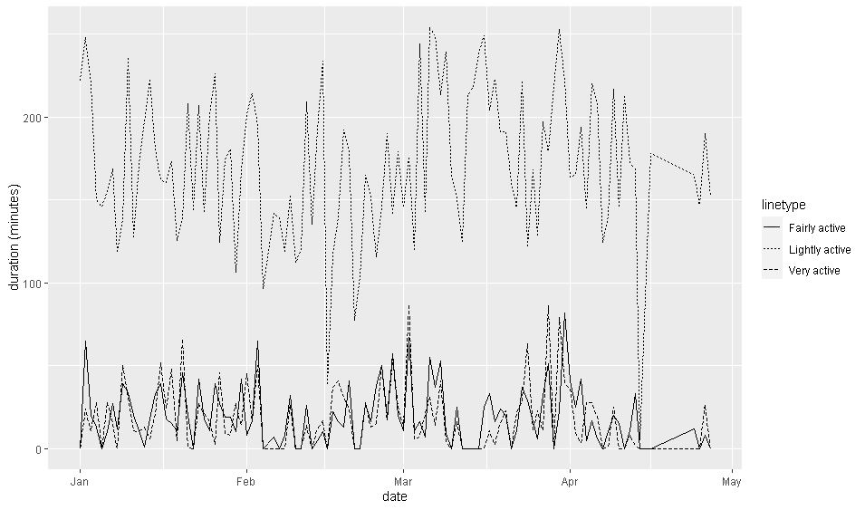
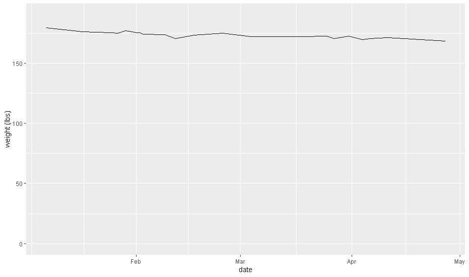

Project Scope
----------------------

The goal of this project is to collect personal data and discover its value in learning about and improve quality of life.

- [**Research:**](/projects/tracking/#research---data-sources){: .btn .btn--primary}
    - Discover personal data that can be collected and Analysed
- [**Data Engineering**:](/projects/tracking/#data-engineering){: .btn .btn--primary}
    - Extract Data from Api's and Csv's with python
    - Store Data in local database
    - Set up automatic update schedule with airflow,and backfill previous days data
- [**Data Cleaning:**](/projects/tracking/#data-cleaningmanipulation){: .btn .btn--primary}
    - Transform Data to consistent date formats
    - Map important features in the data
- [**Data Visualisation**](/projects/tracking/#data-visualisation){: .btn .btn--primary}
    - Plot daily data as metrics with goals on bullet graphs
    - PLot historical data to discover any trends
- [**Planning/Assessing:**](/projects/tracking/#planningassessing--discussion){: .btn .btn--primary}
    - Discuss potential future data analysis
    - Discuss strategies that could have the most practical impact
    - Discuss social/technological potential
    
Research - Data Sources
-------------------------------

I found tons of sources of personal data. I wanted to use data sources that fit a few criteria.

- **Relevant/Add Value**
    - Data provides information that could be useful. e.g. Sleep quality is known to be related to physical and mental health, emails in your spam folder are probably not.
- **Easy to record**
    - Data being collected automatically is alot more likely to be recorded and takes less time than manual recording.
- **Easy to extract**
    - Some apps have API's that make it easy to extract the data and can be done with an automatic process.
- **Accurate/consistent**
    - As the saying goes garbage in garbage out.
- **Free or cheap**
    - I don't want to have to buy extra equipment

**Sources of Data I used**

- **Excercies Tracker(fitbit)**
    - Activity (steps, calories burned, active minutes)
    - Sleep Data (length, restlessness, time got up)
- **Food Tracker(My Fitness Pal)**
    - Food eaten (calories, protein etc)
- **Weight/Bodyfat**
    - Smart scale
- **Computer Usage(Rescue time)**
    - minutes on computer/phone using productive/unproductive applications and websites
- **Location tracker(Google Location history)**
    - times at home/buisinesses/driving
- **Schedule(google calendar/DoItNow app)**
    - event/task times
    - task productivity/challenge level
- **Manual/Spreadsheets**
    - Can use a speadsheet to record any other information I would like. 
    - Success assessments/metrics, other important data that can't be recorded automatically
    - Data about jobs/applications/interviews
    - Subjective life satisfaction values
    
**Other Possible sources**
- Financial data, where my money is going
- Workout data, specific exercises/ repititions
- Emails and communication
- Weather data
- online shopping
- News sentiment/positivity/negativity

Data Engineering
-------------------------------

Example portion of "import.py"


def fitbit_client(id,secret):
    """
    connects to fitbit api client
    id: user fitbit api id
    secret: firbit api password
    returns: fitbit client connection
    """
    server = Oauth2.OAuth2Server(id, secret)
    server.browser_authorize()
    accesstoken = str(server.fitbit.client.session.token['access_token'])
    refreshtoken = str(server.fitbit.client.session.token['refresh_token'])
    client = fitbit.Fitbit(id, secret, oauth2=True, access_token=accesstoken, refresh_token=refreshtoken)
    return client
    
 def collect_body(date,client):
    """
    Retrieve weight data from fitbit api
    date: date to collect
    client: connection to api
    return: pandas dataframe with weight data
    """
    time_list = []
    val_list = []
    body = client.body(date=date)
    bodydf = pd.DataFrame({'date':date,
                'weight':body['body']['weight'],
                'fat':body['body']['fat']
                },index=[0])
    return bodydf
  


**Steps**
- Extract and parse data from various sources with python
- Store in database
- Automate collection Schedule with airflow

I wrote a python package with functions that extract and parse data from the various sources "importer.py".
- **API's**
    - Fitbit and rescuetime have API's. 
    - Credentials have to be collected from your account online. 
    - an API requests is sent with credentials and information you want to request.
    - A response object is returned that can be parsed and turned into a dataframe.
-** Through other apps**
    - MyFitness pal has a private api that requires permission
    - Fitbit app has persmission,so I set the fitbit app to collect from MyFitnessPal and the smart scale
- **Local** - Some apps/services require you to download or save directly to your computer
    - Google location data - download json file form their website
    - DoItNow - database file that can be automatically saved on dropbox
    - Manual inputed Excel/CSV files - already easy to use

Data was stored in a local database file "personal_data.db" with SQLite

I used airflow to automate the daily data collection with the "collect_fitbit.py" and "collect_rescue.py" files. Then I backfilled to collect from the days that have already past.

Data Cleaning/Manipulation
-------------------------------

Using R there were some simple steps to make the data standardised and easily useable.
- The dates were standardised to a consistent format
- Features were added( e.g. Categorize productive/unproductive tasks)
- Missing values were dealt with
- grouping/summarizing

Example manipulation

#Getting sums of productive and unproductive activities per day
rescue_histdf<-rescue_histdf %>%
  group_by(date,productive) %>%
  summarise(duration=sum(duration))


Data Visualisation
---------------------------

In R I made some visualisations for the data that has already been collect "Plot.R". Some of the data has just started to be collected now, so there are only a few points to look at.

I made bullet graph to show possible way to view daily "performance" goal metrics. The blue bar is the current value, the background colours show bad/ok/good values and the black vertical line is a pace line to reach the good region.

Here is a graph of sleeping/restless duration by day. 

Here is a graph of sleeping/restless duration by day. 

Here is a graph of slightly/fairly/very active minutes by day.

Here is a graph of time on computer time on productive/unproductive applications by day. It only has a few days so far, so there is not much information.

There is a fair amount of variability in the graphs but there doesn't appear to be any long term trends except slightly lower weight.

Planning/Assessing- Discussion
-------------------------------

The same analytics/opmiziation/process improvement is possible to use to improve individual "life performance" as is with buisiness performance. Though there is a big difference in resources available to take advantage of it. So there has to be a decision abouit what to focus on.  

**Experiments**  
In this format it is possible to set up experiments.
for example:
- How does a supplement (e.g caffeine/melatonin) affect your productivity/sleep
- Do certain resumes perform better
- Does drinking more water make you feel better
- Do meditation or other thought exercise improve your wellbeing

**Advanced Questions**  
These types of analysis could anwer some complicated question that could have a significant impact. 
- Does a certain schedule improve your work/happiness
- What time investments/tasks have the most returns
- What improves your quality of life  

**Challenges**  
There are a few large hurdles to answering some of the more complicated questions
- Time and resources
- Ability to collect large amounts of data
- Good metrics- Need metrics that can represent complicated/subjective values
- Collecting alot of manual data could be inconvenient/disruptive

**Societal Impact**  
There is also the possibilty in the future that the mass data collection already taking place could be used for improving wellbeing. But there are still many questions/issues with data privacy and data security that society hasn't figured out.

**Conclusion**  
In the near future I am going to continue to look for good metrics and find which data is useful and convenient to collect. 
Thanks for reading. If you have any insight you would like to add, I would be happy to hear it.

[Back](/projects/){: .btn .btn--primary}

References
-----------------------------
[Link to code](https://github.com/chris-ww/personal-data){: .btn .btn--primary}
- **Fitbit and API**
    - [https://dev.fitbit.com/](https://dev.fitbit.com/)
    - [https://dev.fitbit.com/build/reference/web-api/](https://dev.fitbit.com/build/reference/web-api/)
    - [https://python-fitbit.readthedocs.io/en/latest/](https://python-fitbit.readthedocs.io/en/latest/)
    - [https://towardsdatascience.com/collect-your-own-fitbit-data-with-python-ff145fa10873](https://towardsdatascience.com/collect-your-own-fitbit-data-with-python-ff145fa10873)
- **Rescuetime and api**
    - [https://www.rescuetime.com/apidoc](https://www.rescuetime.com/apidoc)
    - [https://github.com/OpenHorizonLabs/rescuetime-python3](https://github.com/OpenHorizonLabs/rescuetime-python3)
- **Google api**
    - [https://developers.google.com/calendar](https://developers.google.com/calendar)
    - [https://takeout.google.com/settings/takeout](https://takeout.google.com/settings/takeout)
    - [https://developers.google.com/calendar/quickstart/python](https://developers.google.com/calendar/quickstart/python)
- **Python and python-packages**
    - [https://pandas.pydata.org/pandas-docs/stable/index.html](https://pandas.pydata.org/pandas-docs/stable/index.html)
    - [https://www.python.org/](https://www.python.org/)
    - [https://airflow.apache.org/docs/stable/](https://airflow.apache.org/docs/stable/)
    - [https://docs.python.org/2/library/sqlite3.html](https://docs.python.org/2/library/sqlite3.html)
- **R and R-packages**
    - [https://www.r-project.org/](https://www.r-project.org/)
    - [https://github.com/mtorchiano/MTkR](https://github.com/mtorchiano/MTkR)
    - [https://www.tidyverse.org/packages/](https://www.tidyverse.org/packages/)
- **SQlite**
    - [https://www.sqlite.org/index.html](https://www.sqlite.org/index.html)