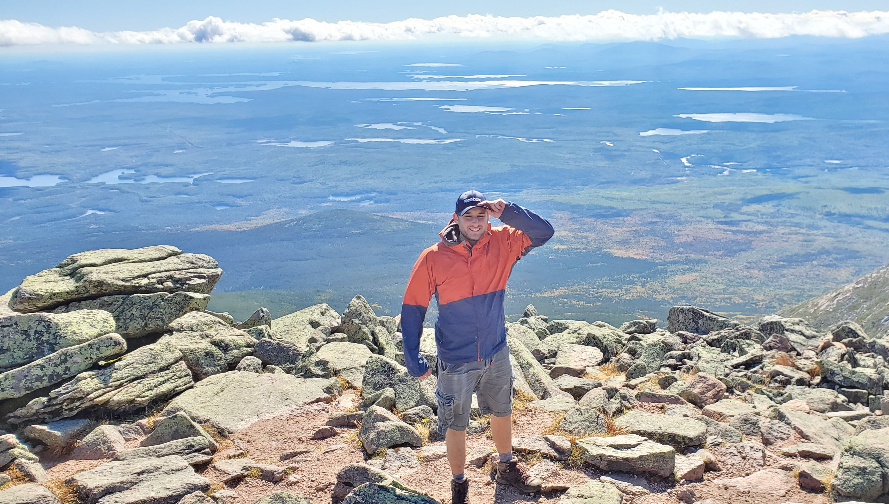

---
---
About
----------------------

Background
----------------------------

Hi, my name is Chris Werner-Westoby

I work with problem solving using Statistics/ Machine learning and AI. My goal is to develop a broad range of skills and an become the best version of myself that i can. I hope for a career that keeps on the edge of current knowledge/technology, creates positive challenges and and has a postive societal impact.

Interests
---------------------------

I have a wide variety of interests including.

- **Mathematical:** Statistics, machine learning, AI, AGI, decision theory.
- **Science:** Biology (ecology, genetics, physiology), Pyschology (Thinking/learning, social/group psychology)
- **Humanities:** Philosophy (science, epistemology, ethics)
- **Hobbies:** Fitness, rock climbing, camping/hiking, programming, Reading

Contact
----------------------------

Feel free to contact me or connect

Email: ww.chris@outlook.com  
linkedin: [www.linkedin.com/in/chris-werner-westoby](https://www.linkedin.com/in/chris-werner-westoby)

[Back](/){: .btn .btn--primary}
