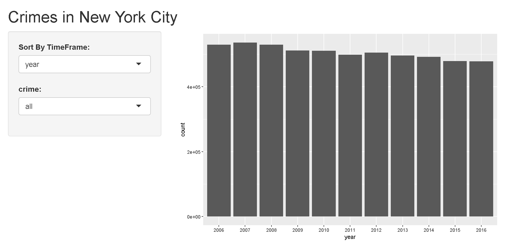
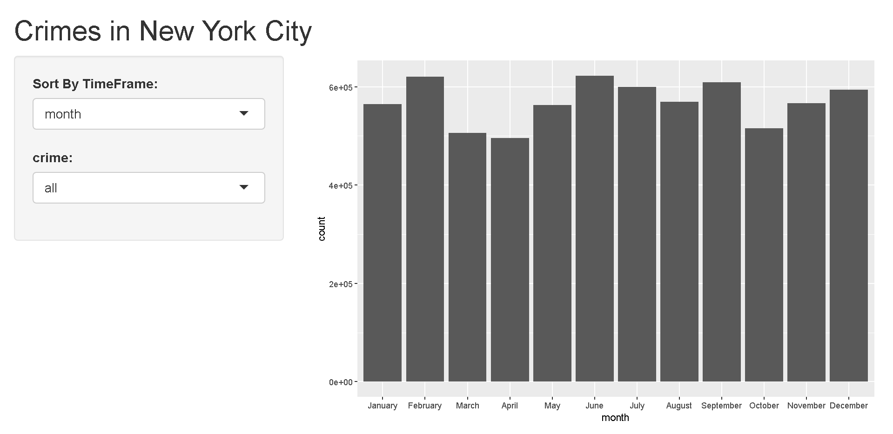
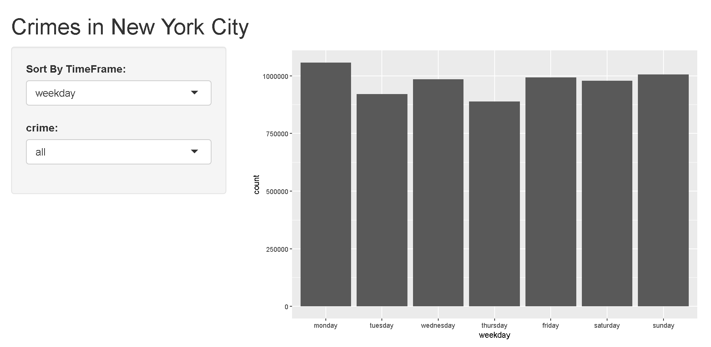
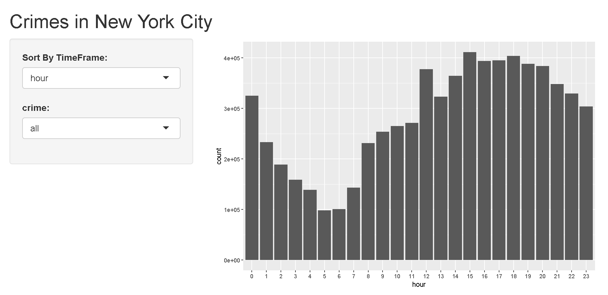
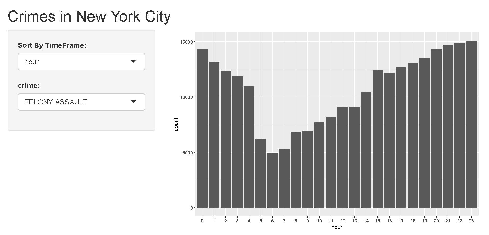
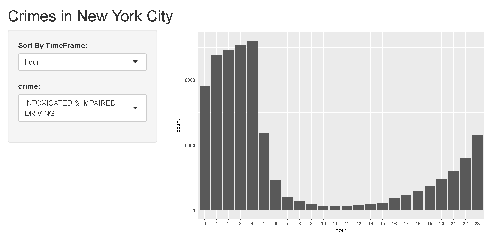
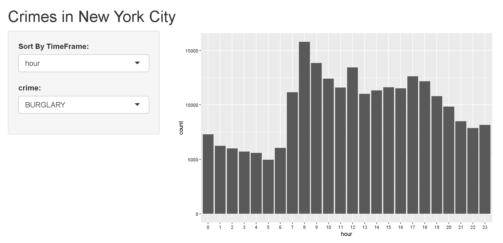
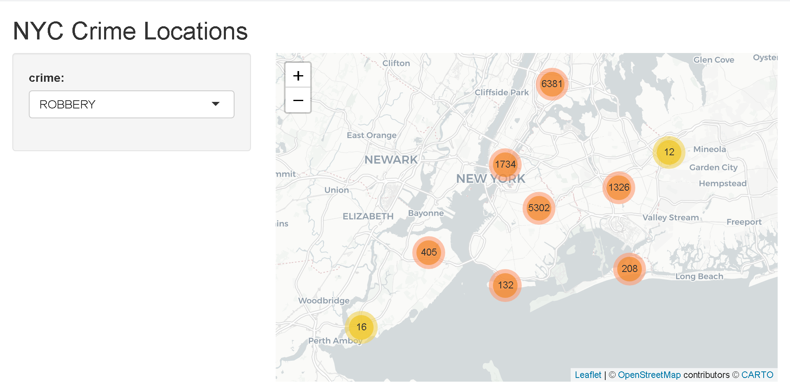
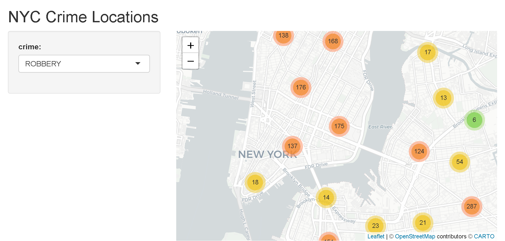
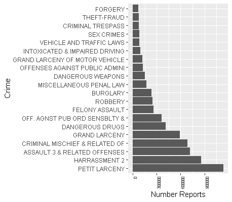

For this project I used reported crime data from new york city.

Crimes by Time Dashboard: 
[http://chris-ww.shinyapps.io/crime_history](http://chris-ww.shinyapps.io/crime_history)

Crime Location Dashboard:
[http://chris-ww.shinyapps.io/location_map](http://chris-ww.shinyapps.io/location_map)

Crimes by Time
--------------------------------

The first dashboard allows you to look at how often different crimes were reported by year, month, weekday and hour. I will show some of the more interesting results here, but you can examine more yourself by clicking the dashboard link. 

Overall the number of crimes reported appears to be dropping by year.

The crimes per month appear to be similar for most crimes.

The number of crimes appears to also be fairly similar by weekdays.

Overall more crimes are commited in the evening and less overnight when people are sleeping.

Some crimes like assault and driving under intoxication were more common at night.

While Burlary is more common during the day when people are not at their homes.

Crimes by Location
--------------------------------------------------------

The second dashboard contains the locations of crimes in 2016. You can select the crime and search around the map to find where they occured.

You can select a crime and zoom to anywhere on the map of New York City.

Summary Information
--------------------------------------------------------

Most common crimes in dataset

The most commonly reported crimes over the decade were petit larceny, harrassment in the 2nd degree and assault in the 3rd degree.  
* Petit larceny: Theft Under $1000 
* Harrassment 2nd degree: Single Incident Harrassment 
* Assault Third Degree: Assualt without substantial pain or physical inhury

