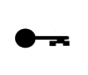

- [New York City Crime Dashboards/Analysis](/projects/crime/){: .btn .btn--primary} [**Github Code**](https://github.com/chris-ww/crime-data){: .btn .btn--primary}
    - **Description:** Using Reported crime data from New york City
    - **Tools:** R, Shiny  
    - **Tags:** Big Data, Dashboards, Data analysis  
    
- [Gathering and Analyzing Personal Data](/projects/tracking/){: .btn .btn--primary} [**Github code**](https://github.com/chris-ww/personal-data){: .btn .btn--primary}
    - **Description:** Use API's to gather and transform data from exercise tracker, calendar and location history.  
    - **Tools:** Python, R, airflow, SQlite, html, json, csv, db  
    - **Tags:** Data engineering, API's, analytics  

- [Scheduling](/projects/scheduler/){: .btn .btn--primary} [**Github Code**](https://github.com/chris-ww/scheduler){: .btn .btn--primary}
    - **Description:** A simple scheduling package to assign/reassign employees to tasks
    - **Tools:** Python, MySQL, Cron
    - **Tags:** scheduling
    

    

       
    

<html>

</html>
